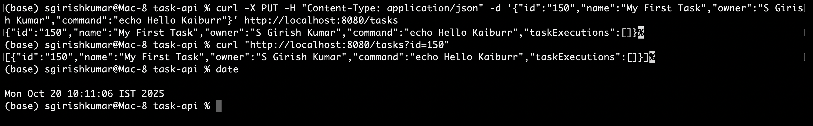
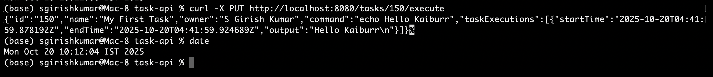
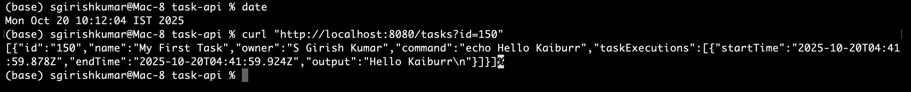
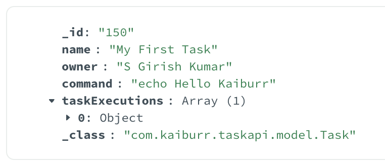

# Kaiburr Task 1: Java REST API for Task Management

This project is a Java-based REST API built with **Spring Boot** and **MongoDB**. It provides a set of endpoints to manage and execute shell command "tasks," as specified in the Kaiburr engineering assessment (Task 1).

## Core Technologies
- **Java 17**
- **Spring Boot 3** (for REST controllers, dependency injection)
- **Spring Data MongoDB** (for database interaction)
- **Maven** (for project build and dependency management)
- **Lombok** (to reduce boilerplate code)

---

## Prerequisites

Before you begin, ensure you have the following installed on your system:
- **Java Development Kit (JDK) 17** or newer
- **Apache Maven**
- **MongoDB** (must be running for the application to connect)

---

## 🚀 How to Run the Application

Follow these steps to get the application running locally.

### 1. Clone the Repository
Open your terminal and clone this repository:
```bash
git clone https://github.com/your-username/kaiburr-task1-java-api.git
cd kaiburr-task1-java-api
```
*(Please replace `your-username` with your actual GitHub username)*

### 2. Configure the Database
The application is configured by default to connect to a local MongoDB instance at `mongodb://localhost:27017/kaiburr_task1`.

If your MongoDB instance is running elsewhere, please update the connection URI in the following file:
`src/main/resources/application.properties`

### 3. Build and Run
Use the included Maven wrapper to build the project and run the application. This ensures you use the correct Maven version.

```bash
# This single command will compile the code and start the server
./mvnw spring-boot:run
```
The API server will start and be available at `http://localhost:8080`.

---

## API Endpoints Documentation

You can interact with the API using any HTTP client like `cURL` or `Postman`.

| Method | Endpoint                    | Description                                                                 | Sample cURL Command                                                                                                                                      |
| :----- | :-------------------------- | :-------------------------------------------------------------------------- | :------------------------------------------------------------------------------------------------------------------------------------------------------- |
| `GET`  | `/tasks`                    | Get all tasks stored in the database.                                       | `curl http://localhost:8080/tasks`                                                                                                                       |
| `GET`  | `/tasks?id={id}`            | Get a single task by its unique ID.                                         | `curl "http://localhost:8080/tasks?id=101"`                                                                                                              |
| `GET`  | `/tasks?name={name}`        | Find tasks where the name contains the provided string (case-insensitive).  | `curl "http://localhost:8080/tasks?name=First"`                                                                                                          |
| `PUT`  | `/tasks`                    | Create a new task. The task object is passed in the JSON request body.      | `curl -X PUT -H "Content-Type: application/json" -d '{"id":"101","name":"My First Task","owner":"Your Name","command":"echo Hello Kaiburr"}' http://localhost:8080/tasks` |
| `PUT`  | `/tasks/{taskId}/execute`   | Executes the shell command of a given task and logs the result.             | `curl -X PUT http://localhost:8080/tasks/101/execute`                                                                                                    |
| `DELETE`| `/tasks/{id}`               | Deletes a task by its ID.                                                   | `curl -X DELETE http://localhost:8080/tasks/101`                                                                                                         |

---

## ✅ Demonstration Screenshots

The following screenshots provide visual proof of the API's functionality, from creating a task to executing it and verifying persistence in the database.

*(Note: All screenshots include my username and the system date/time to meet submission requirements.)*

### 1. Creating a Task and Verifying Retrieval
This screenshot shows the `PUT /tasks` command to create a new task, followed by a `GET /tasks` command to show it has been successfully saved.

<!-- IMPORTANT: REPLACE 'link-to-your-screenshot-1.png' WITH THE ACTUAL LINK TO YOUR IMAGE -->


### 2. Executing a Task
This screenshot shows the call to the `PUT /tasks/{taskId}/execute` endpoint.

<!-- IMPORTANT: REPLACE 'link-to-your-screenshot-2.png' WITH THE ACTUAL LINK TO YOUR IMAGE -->


### 3. Verifying Task Execution Result
After execution, this screenshot shows a final `GET /tasks` request where the `taskExecutions` array is now populated with the command output, start time, and end time.

<!-- IMPORTANT: REPLACE 'link-to-your-screenshot-3.png' WITH THE ACTUAL LINK TO YOUR IMAGE -->


### 4. Proof of Persistence in MongoDB
This screenshot from MongoDB Compass (or a similar client) shows the task document stored in the `kaiburr_task1` database, confirming data persistence.

<!-- IMPORTANT: REPLACE 'link-to-your-screenshot-4.png' WITH THE ACTUAL LINK TO YOUR IMAGE -->

